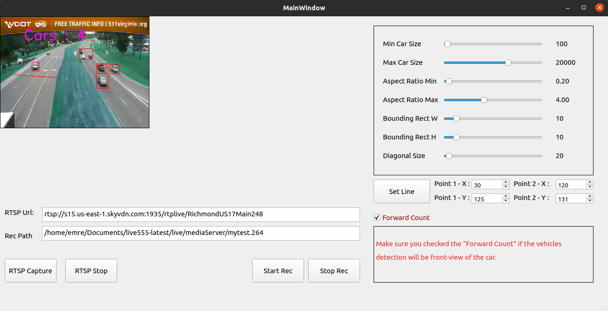

# VehicleCountQt 
Video Link : https://youtu.be/v9pzuO6M4_A

# Requirements: 
-Crow Framework
-Qt Framework C++
-Npm http-server
-Ngrok

# How to Run ?  

-We want to start an hls stream related with the Vehicle Counter Project. Vehicle Counter Project records the processed 
frames as mp4 file and this project turns mp4 file to hls stream.  

-When the video is started click the screen where you want to put the beginning of the line and 
click second time to screen for selecting end of the line ,

# Settings
-There is a panel that helps to set configurations easly for each stream. 
