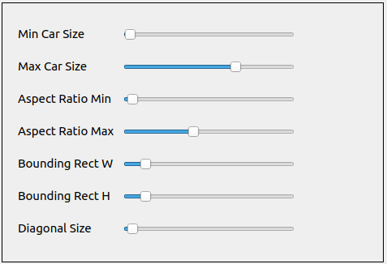

# VehicleCountQt 
Video Link : https://youtu.be/v9pzuO6M4_A

# Requirements: 
-Crow Framework  
-Qt Framework C++  
-Npm http-server  
-Ngrok  

# How to Run ?  

-We want to start an hls stream related with the Vehicle Counter Project. Vehicle Counter Project records the processed 
frames as mp4 file and this project turns mp4 file to hls stream.  

-When the video is started click the screen where you want to put the beginning of the line and 
click second time to screen for selecting end of the line ,

# Settings  
-There is a panel that helps to set configurations easly for each stream.   

-Min Car Size : This is a base limit of a car size as area.  
-Max Car Size : This is an upper limit of a car size as area.    
-Aspect Ratio Min : This is an minimum aspect ratio of an each cars.  
-Aspect Ratio Max : This is an maximum aspect ratio of each cars. These values can be keep as same.  
-Bounding Rect : This value should be small when the rtsp stream frame size is small. For greater stream sizes this can be set higher.  
-Diagonal Size : This value also should be small when the rtsp stream frame size is small. Decreasing this value will cause to detect smaller blobs.  
